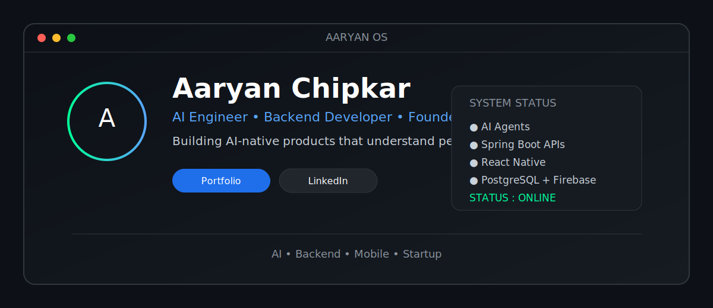

# Aaryan Chipkar

### Building AI-native products that understand people.

  <a href="https://www.nocaps.in">🌐 Portfolio</a> •
  <a href="https://linkedin.com/in/aaryanchipkar">💼 LinkedIn</a> •
  <a href="mailto:YOUR_EMAIL">📧 Email</a>

---

# 🚀 Featured Projects

<table>
<tr>

<td width="50%">

### ❤️ Nocaps

AI-native compatibility platform focused on meaningful human connections through behavioral intelligence.

**Tech**

`Python` `Flask` `Supabase` `Firebase` `AI Agents`

<a href="https://github.com/Aaryan170202">
View Repository →
</a>

</td>

<td width="50%">

### 💰 Budget Tracker

Enterprise-ready personal finance backend built using Spring Boot.

**Tech**

`Java` `Spring Boot` `PostgreSQL`

<a href="https://github.com/Aaryan170202">
View Repository →
</a>

</td>

</tr>

<tr>

<td width="50%">

### 🛡 Smart Helmet

Patent-published IoT smart safety helmet with accident detection and emergency response.

</td>

<td width="50%">

### 🤖 AI Agents

Multi-agent conversational systems for personality analysis, compatibility prediction and human-centered AI.

</td>

</tr>

</table>

---

# 💻 Tech Stack

### Languages

### Backend

### Database

### Cloud & Tools

---

# 📊 GitHub Analytics

 

 

---

# 🌱 Currently Building

- ❤️ Nocaps — AI-native compatibility platform
- 🤖 Multi-Agent AI systems
- 📱 React Native mobile applications
- ☁️ Cloud-native backend systems
- 🧠 Human behavior intelligence models

---

# 📬 Connect

<a href="https://www.nocaps.in">
Portfolio
</a>

•

<a href="https://linkedin.com/in/aaryanchipkar">
LinkedIn
</a>

•

<a href="mailto:YOUR_EMAIL">
Email
</a>

•

<a href="https://github.com/Aaryan170202">
GitHub
</a>

---

