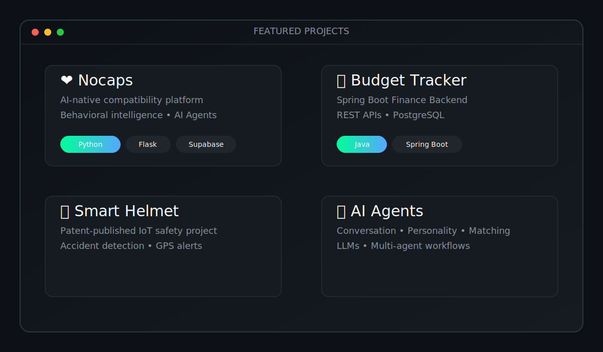
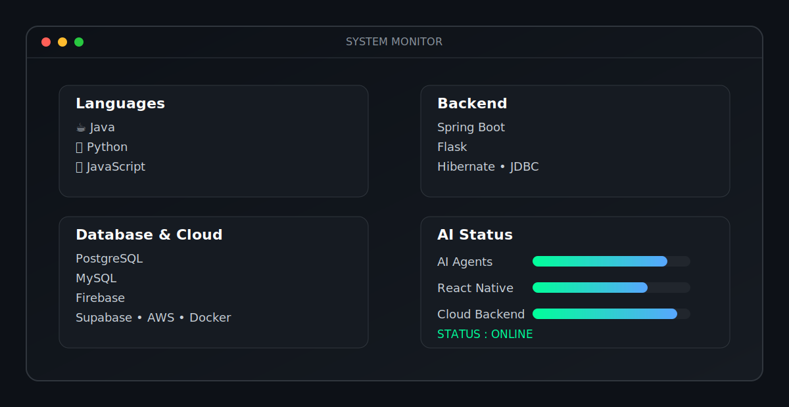
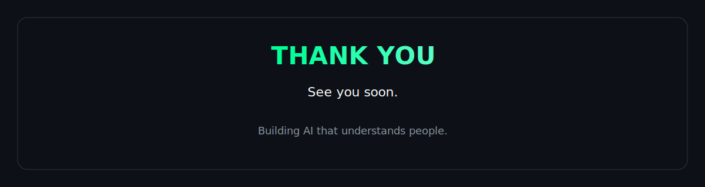

<div align="center">



<br/>

**I build systems that understand people — then ship them.**

AI Engineer · Backend Developer · Founder [@Nocaps](https://www.nocaps.in)

<p>
<a href="https://www.nocaps.in"></a>
<a href="https://www.linkedin.com/in/aaryanchipkar"></a>
<a href="mailto:aaryanchipkar17@gmail.com"></a>

</p>

</div>


## `whoami`

```console
guest@aaryan.sys:~$ whoami --verbose
```

I'm an AI Engineer and full-stack developer working at the intersection of **artificial intelligence and human behavior** — AI agents, mobile apps, and the backend systems that hold them up.

Right now I'm building **Nocaps**, an AI-native compatibility platform where multiple agents interpret personality and behavioral signals to help people form better connections. Alongside that: two years of production Java/Spring Boot backend work, and a **published patent** for an IoT safety system.

| | |
|---|---|
| 📍 **Based in** | India |
| 🛠 **Experience** | 2+ years shipping to production |
| 🧪 **Currently** | scaling Nocaps · AI agents · system design |
| 📡 **Status** | open to new projects — [start one →](mailto:aaryanchipkar17@gmail.com) |

> **Try my portfolio, don't scroll it.** [**aaryan.sys**](https://www.nocaps.in) is an operating system, not a landing page — draggable windows, a terminal that actually parses commands, a three-game arcade, and a hidden 9-signal side quest that ends in a compatibility report generated by the same matching engine that powers Nocaps. Type `sudo hire aaryan` and see what happens.


## `cat featured.md`

### 🩷 Nocaps — AI-Native Compatibility Platform &nbsp;<sub>`founder · flagship`</sub>

A platform that understands personality, communication style, emotional patterns, and behavioral signals through **natural conversation** — before recommending highly compatible human connections. Three agents run the pipeline:

| Agent | Role | What it does |
|---|---|---|
| **AMORE‑1** | Conversational AI | Talks naturally, learns personality, harvests compatibility signals |
| **AMORE‑2** | Behavior Intelligence | Turns conversation into embeddings across **53 signals**, scores **12 compatibility dimensions**, detects attachment styles |
| **AMORE NET** | Compatibility Engine | Matches users, explains *why*, generates full compatibility reports |

`React Native` `Flask` `Python` `PostgreSQL` `Supabase` `Redis` `Firebase Auth` `Grok` `Qwen`

🌐 **Live at [nocaps.in](https://www.nocaps.in)** · 📱 Play Store launching soon · 🍎 iOS September 2026

---

### 💰 AI-Powered Budget Tracker &nbsp;<sub>`three iterations, one lesson each`</sub>

Built the same product three times — each version deleting an assumption from the last.

| | Version | What changed |
|---|---|---|
| **V1** | Raw backend | Java · Spring Boot · JDBC · MySQL — make it work |
| **V2** | Cloud-native | Refactored to JPA/Hibernate, deployed on AWS (RDS, S3, SES) — make it scale |
| **V3** | AI layer | Receipt OCR + auto-categorization via AWS Textract — make it smart |

---

### 🛡 Smart Helmet for Construction Worker Safety &nbsp;<sub>`📜 patent published`</sub>

IoT safety helmet that detects accidents and hazardous gas levels in real time, with GPS tracking and automatic GSM emergency alerts. Hardware that calls for help when a person can't.

`Arduino` `IoT` `Sensors` `GSM` `GPS`




## `ls -la /skills`

<div align="center">

**Languages**


**AI & Agents**


**Backend**


**Mobile & Frontend**


**Data & Cloud**


</div>




## `history | grep work`

**Backend Engineer** &nbsp;·&nbsp; `Java · Spring Boot · SQL` &nbsp;·&nbsp; *July 2024 – Present*

<details open>
<summary><b>Enterprise IVR Platform</b></summary>

- Built backend services in Java and Spring Boot for an enterprise IVR system
- Designed and maintained the REST APIs consumed by the IVR platform
- Wrote and debugged production SQL; owned live incident resolution
- Worked cross-functionally in an Agile delivery team

</details>

<details>
<summary><b>Rate Calculator Tool</b></summary>

- Developed backend modules for premium and rate calculation logic
- Optimized SQL queries, measurably improving application performance
- Identified and fixed production defects to improve reliability

</details>


## `systemctl status`

<div align="center">


</div>


## `crontab -l` — what I'm on this quarter

```text
* * * * *   scale nocaps          # web live, mobile shipping
0 * * * *   ai agents & llm eng   # multi-agent workflows, evals
0 9 * * *   cloud-native backend  # aws, containers, reliability
0 18 * * *  react native          # cross-platform, app store
0 21 * * *  system design + dsa   # the long game
```


## `open contact`

I read every message myself. Whether it's a full product build, an AI agent, a backend that needs rescuing, or just a good conversation about where this is all going — my inbox is open.

<div align="center">

**AI Agents** · **Mobile Apps** · **Backend & APIs** · **Startup MVPs** · **AI Consultation**

<a href="mailto:aaryanchipkar17@gmail.com"></a>
<a href="https://www.linkedin.com/in/aaryanchipkar"></a>
<a href="https://github.com/Aaryan170202"></a>
<a href="https://www.nocaps.in"></a>

</div>



<div align="center">

```console
guest@aaryan.sys:~$ sudo hire aaryan
permission granted ✔ escalating to human…
```

</div>


