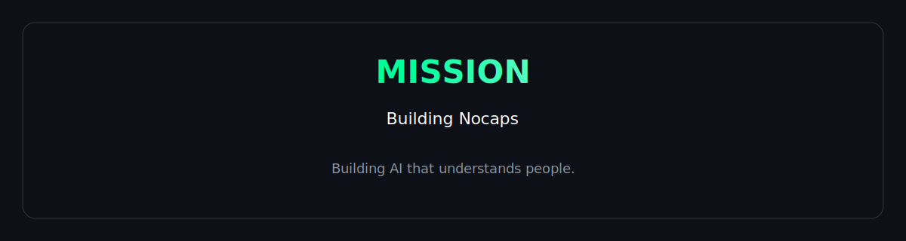
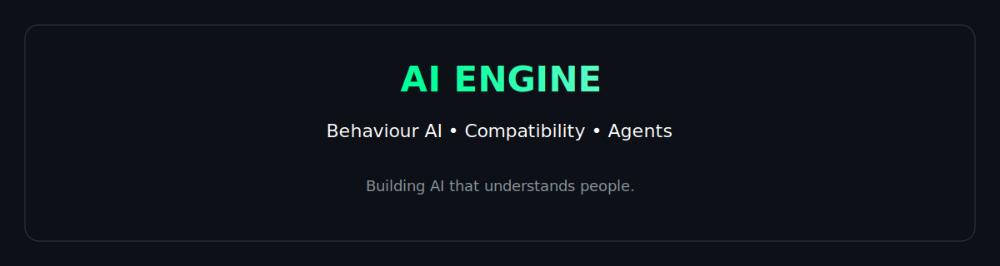
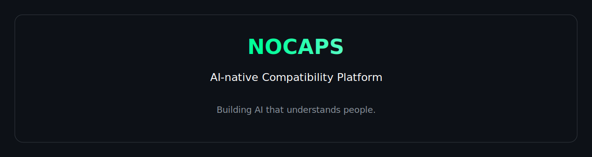
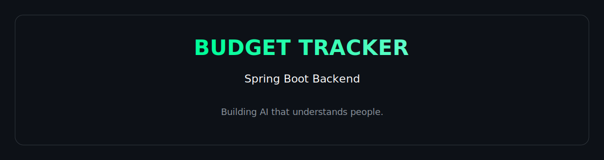
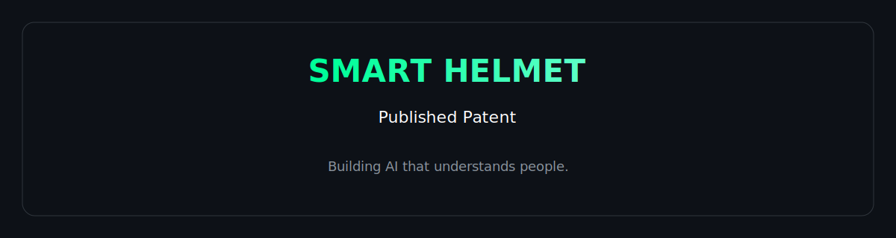
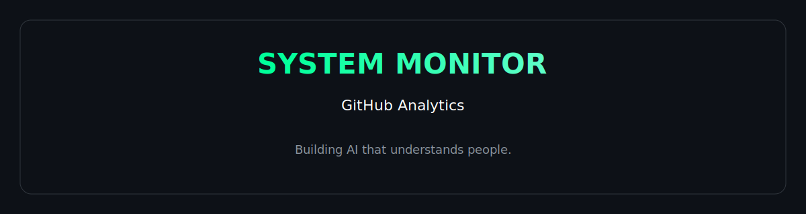

  

# AI Engineer • Backend Developer • Founder @ Nocaps

### Building AI that understands people.

---

  

I'm an AI Engineer passionate about building AI-powered products that solve real human problems.

Currently building **Nocaps**, an AI-native compatibility platform focused on meaningful human connections through behavioural analysis and intelligent matching.

---

  

## Current Focus

- 🤖 AI Agents
- ☕ Java & Spring Boot
- 📱 React Native
- 🧠 Human Behaviour AI
- ☁️ Cloud Backend Architecture

---

  

### AI Stack

- Grok
- Qwen
- AI Agents
- Behaviour Analysis
- Compatibility Engine
- Conversation Intelligence

---

# Featured Projects

  

### Nocaps

AI-native compatibility platform focused on understanding people before matching them.

---

  

### Personal Budget Tracker

Enterprise-style backend application built with Spring Boot.

---

  

### Smart Helmet

Published patent focused on intelligent rider safety.

---

# Tech Stack

### Languages

Java • Python • JavaScript • SQL • Kotlin

### Backend

Spring Boot • Spring MVC • Hibernate • JPA • Flask • REST APIs

### Database

PostgreSQL • MySQL • Firebase • Supabase

### Cloud

AWS • Docker • Git • GitHub • Linux

---

  

---

# Experience

**System Engineer — Tata Consultancy Services**

- Java Backend Development
- REST APIs
- SQL
- Enterprise Applications
- Production Support

---

# Let's Connect

<a href="https://github.com/Aaryan170202">GitHub</a> •
<a href="https://linkedin.com/in/aaryanchipkar">LinkedIn</a> •
<a href="https://www.nocaps.in">Nocaps</a>

---

  

